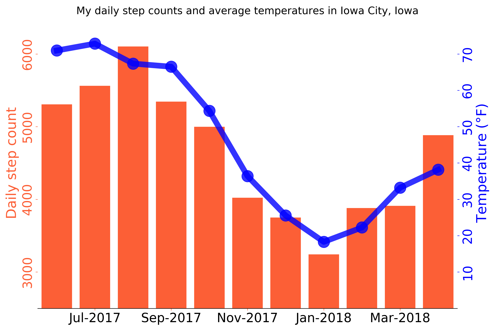

# Extraction and analysis of iPhone step counts 📱

This Jupyter notebook contains code for extracting, analyzing, and visualizing step count data collected on an Apple iPhone. I wrote a post about this project on [my blog](https://www.johnwmillr.com/exporting-apple-health-data/).

